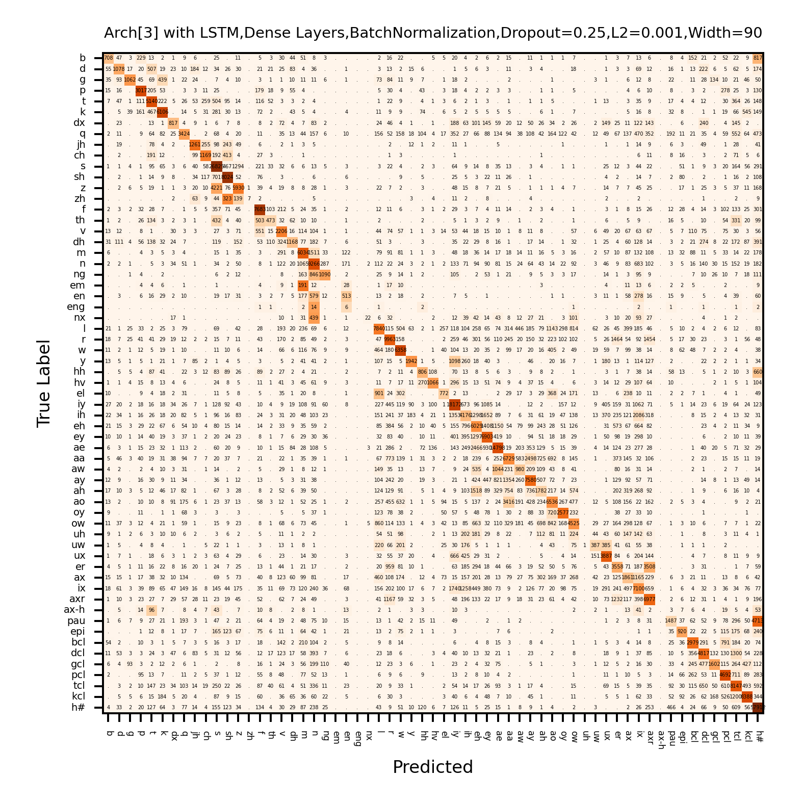

# Phoneme Recognition with Recurrent Neural Networks

This project focuses on phoneme recognition using neural network architectures on the TIMIT corpus. The goal was to identify phonemes based on audio feature inputs and evaluate performance across several RNNs-based models. Credit to Dr. Roch for providing the model generation code and project architecture

##  Overview

The project included implementing and testing 6 architectures using Long Short-Term Memory (LSTM) and Gated Recurrent Unit (GRU) layers. 

Key factors for evaluation included:
- **Recurrent Unit Type:** Comparison between LSTM and GRU layers  
- **Network Depth and Width:** Variation in the number and width of dense layers
- **Regularization Techniques:** Integration of dropout and L2 regularization
- **Normalization:** Assessment of batch normalization's impact

All models concluded with a softmax activation function in the output layer.

## Best Performing Model

Error Rate: 0.38

